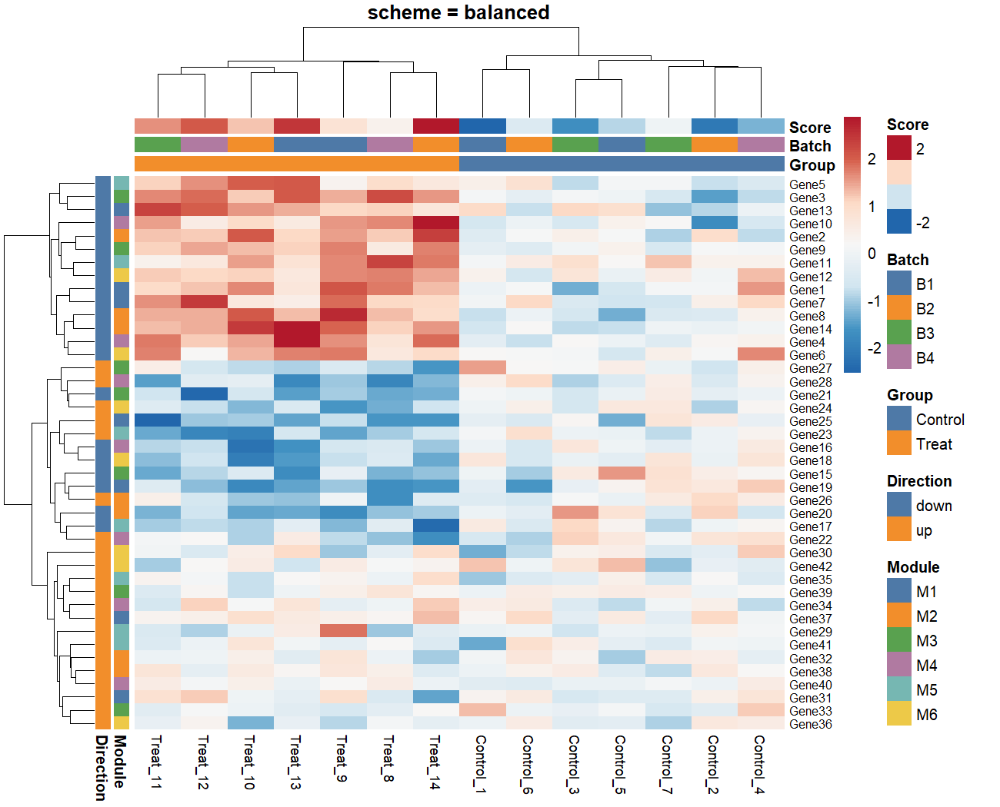
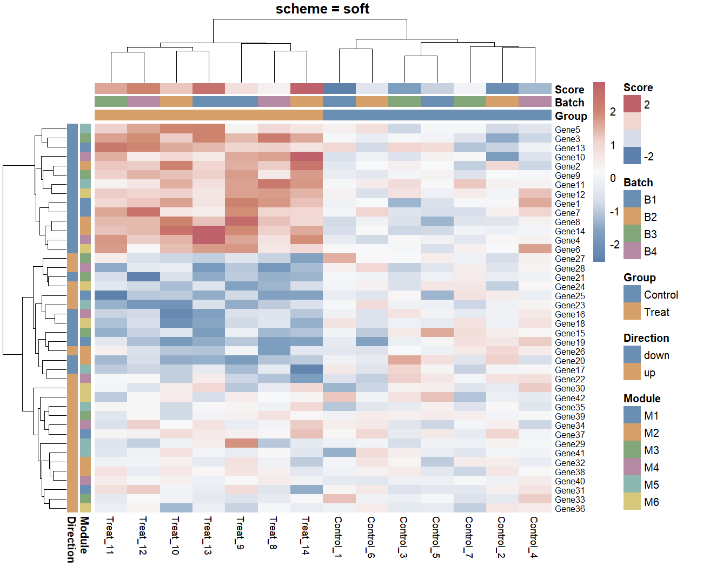
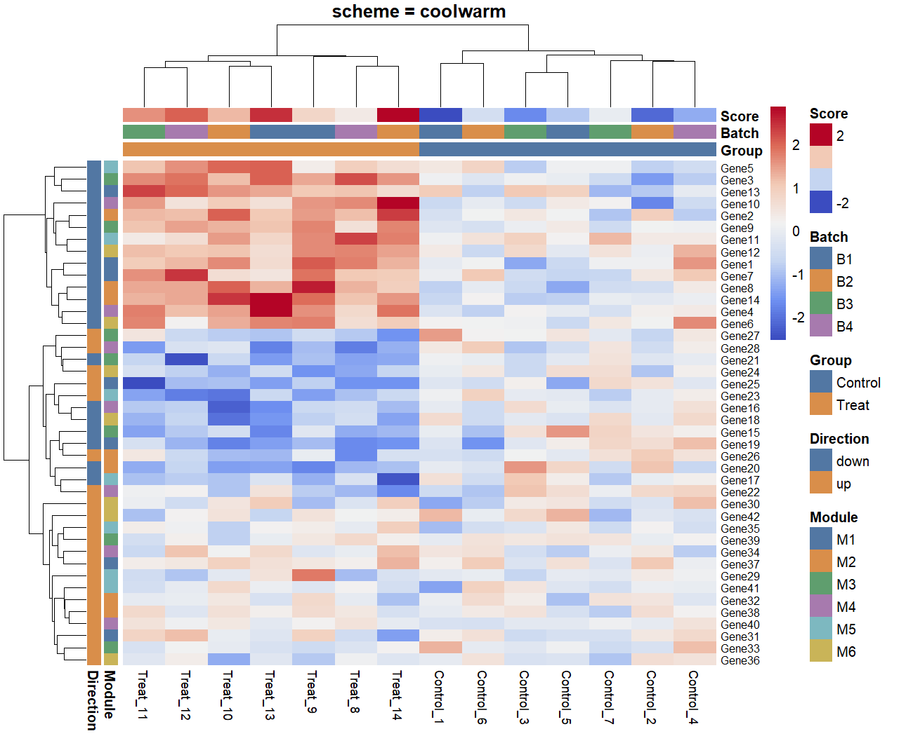
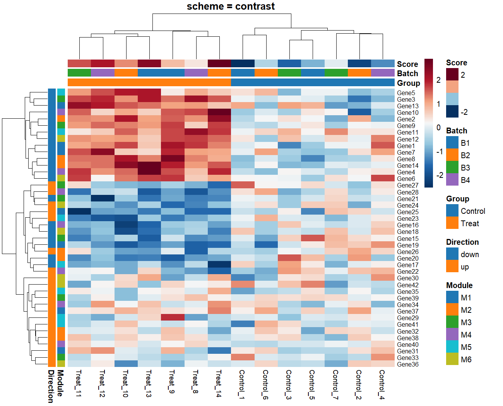

# pheatmapColor

`pheatmapColor` is a lightweight wrapper around
[`pheatmap`](https://cran.r-project.org/package=pheatmap) that keeps the familiar
`pheatmap::pheatmap()` workflow while improving default heatmap and annotation
colors.

The package is designed for expression matrices, differential-expression
heatmaps, sample grouping, clustering annotations, and other common biological
heatmap workflows where `pheatmap` is convenient but annotation colors take too
much manual work.

## Why this package?

`pheatmap` already supports manual annotation colors through
`annotation_colors`, but writing and maintaining those color lists can be
tedious:

```r
annotation_colors <- list(
  Group = c(Control = "#4E79A7", Treat = "#F28E2B"),
  Batch = c(B1 = "#59A14F", B2 = "#B07AA1")
)
```

`pheatmapColor` adds publication-oriented color schemes and partial manual
overrides, while still passing most plotting arguments to `pheatmap`.

## Installation

```r
# install.packages("remotes")
remotes::install_github("XiaoLi1991-star/pheatmapColor")
```

## Basic usage

```r
library(pheatmapColor)

# mat: genes x samples expression matrix
# annotation_col: sample metadata; rownames must match colnames(mat)
pheatmap_bio(
  mat,
  annotation_col = annotation_col,
  scheme = "balanced",
  scale = "row",
  show_rownames = FALSE
)
```

`annotation_col` describes the columns of the matrix:

```r
annotation_col <- data.frame(
  Group = c("Control", "Control", "Treat", "Treat"),
  Batch = c("B1", "B2", "B1", "B2"),
  row.names = c("Control_1", "Control_2", "Treat_1", "Treat_2")
)
```

The row names of `annotation_col` should match `colnames(mat)`.

Use `annotation_row` for row annotations, such as gene modules:

```r
annotation_row <- data.frame(
  Module = c("M1", "M1", "M2", "M2"),
  row.names = rownames(mat)
)

pheatmap_bio(
  mat,
  annotation_col = annotation_col,
  annotation_row = annotation_row,
  scheme = "soft"
)
```

## Built-in schemes

Available schemes:

```r
pheatmap_schemes()
```

Current choices:

```r
c(
  "balanced", "soft", "contrast", "coolwarm", "ember",
  "marine", "forest", "mono", "muted", "vivid"
)
```

Recommended starting points:

- `balanced`: default choice for most figures
- `soft`: dense heatmaps, subtle publication-style figures
- `coolwarm`: classic Z-score expression heatmaps
- `contrast`: stronger separation for presentations or clear module patterns
- `muted`: annotation colors should stay quiet
- `vivid`: stronger annotation recognition, best used sparingly

## Examples

### Default scheme

```r
pheatmap_bio(
  mat,
  annotation_col = annotation_col,
  annotation_row = annotation_row,
  scheme = "balanced",
  scale = "row"
)
```



### Softer publication style

```r
pheatmap_bio(
  mat,
  annotation_col = annotation_col,
  annotation_row = annotation_row,
  scheme = "soft",
  scale = "row"
)
```



### Classic cool-warm expression palette

```r
pheatmap_bio(
  mat,
  annotation_col = annotation_col,
  annotation_row = annotation_row,
  scheme = "coolwarm",
  scale = "row"
)
```



### Higher contrast

```r
pheatmap_bio(
  mat,
  annotation_col = annotation_col,
  annotation_row = annotation_row,
  scheme = "contrast",
  scale = "row"
)
```



## Manual overrides

You can still override selected annotation levels. Missing levels are filled
automatically by the selected scheme.

```r
pheatmap_bio(
  mat,
  annotation_col = annotation_col,
  scheme = "balanced",
  annotation_colors = list(
    Group = c(Treat = "#B2182B")
  )
)
```

This keeps the wrapper convenient while preserving control over important
biological groups.

## Reusing only annotation colors

Use `bio_annotation_colors()` when you want colors but still want to call
`pheatmap::pheatmap()` yourself:

```r
anno_colors <- bio_annotation_colors(annotation_col, scheme = "soft")

pheatmap::pheatmap(
  mat,
  annotation_col = annotation_col,
  annotation_colors = anno_colors
)
```

## Compatibility with pheatmap arguments

`pheatmap_bio()` forwards additional arguments through `...` to
`pheatmap::pheatmap()`, so common `pheatmap` options continue to work:

```r
pheatmap_bio(
  mat,
  annotation_col = annotation_col,
  scheme = "balanced",
  scale = "row",
  cluster_rows = TRUE,
  cluster_cols = TRUE,
  show_rownames = FALSE,
  cutree_rows = 4,
  fontsize = 10
)
```

The wrapper sets two defaults:

```r
color = scheme_heatmap_palette
border_color = NA
```

## Resolved values for tuning

By default, `pheatmap_bio()` and `bio_annotation_colors()` print the resolved
values with `message()`. Most values are color-related rather than layout
parameters: the selected scheme, pheatmapColor defaults, generated heatmap
palette size, generated annotation colors, and user-supplied pheatmap arguments.
It does not introspect pheatmap's internal layout decisions such as tree height,
cell size, or legend placement.
This makes iterative tuning easier, especially when an agent or a collaborator
needs to know the exact values used in the previous plot.

Example message:

```text
pheatmapColor resolved values
pheatmap_bio:
  user inputs:
    scheme: muted
    matrix: 5 rows x 4 columns
    annotation_col: Group
    annotation_row: none
    pheatmap_args: silent=TRUE
  pheatmapColor defaults:
    heatmap_palette: scheme muted, n = 100
    border_color: NA
  annotation colors:
    Group: Control=#6C7A89, Treat=#B8A36F
  annotation_values:
    Group: 2 levels (Control, Treat)
```

Set `verbose = FALSE` to suppress these messages:

```r
pheatmap_bio(
  mat,
  annotation_col = annotation_col,
  scheme = "balanced",
  verbose = FALSE
)
```

You can override them:

```r
pheatmap_bio(
  mat,
  annotation_col = annotation_col,
  color = colorRampPalette(c("navy", "white", "firebrick3"))(100),
  border_color = "grey90"
)
```

## Many annotation groups

For up to 12 groups, each scheme uses hand-picked annotation colors.

When an annotation variable has 13-36 groups, the package switches to a
high-distinction palette so colors remain more separable. This is a practical
fallback, not a promise that 30 groups will be visually elegant.

When an annotation variable has more than 24 groups, the package warns that the
legend may be hard to read. In that case, consider merging rare groups, splitting
the heatmap, or using fewer annotation categories.

## Relationship to pheatmap

This package does not reimplement heatmap drawing. It uses `pheatmap` for the
actual plot and focuses on better default color handling.

Because `pheatmap` is licensed under GPL-2, this package is also licensed under
GPL-2.

## Development checks

```r
testthat::test_dir("tests/testthat")
```

From a shell:

```sh
R CMD build .
R CMD check --no-manual --no-build-vignettes pheatmapColor_0.0.1.tar.gz
```
